<p align="center">
  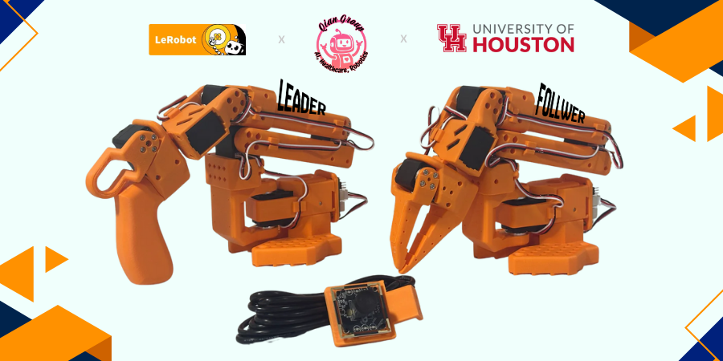
</p>

<h1 align="center">SO-101 Robotic Arm Lab</h1>

<p align="center">
  <strong>Qian Group · Human–Robot Interaction Lab · University of Houston</strong>
</p>

<p align="center">
  <em>From unboxing to autonomous manipulation — a complete, reproducible pipeline for building, calibrating, and deploying imitation-learning policies on the SO-101 robotic arm platform.</em>
</p>

<p align="center">
  <a href="https://github.com/Qian-Group-HRI/so101-robotic-arm-lab/stargazers">
    
  </a>&nbsp;
  <a href="https://github.com/Qian-Group-HRI/so101-robotic-arm-lab/network/members">
    
  </a>&nbsp;
  <a href="https://github.com/Qian-Group-HRI/so101-robotic-arm-lab/issues">
    
  </a>&nbsp;
  <a href="#">
    
  </a>&nbsp;
  <a href="https://github.com/huggingface/lerobot">
    
  </a>&nbsp;
  <a href="https://huggingface.co/datasets/G3nadh/so101_pick_place">
    
  </a>
</p>

<br>

---

<br>

## Table of Contents

| | Section | Description |
|---|---------|-------------|
| 🧭 | [Introduction](#introduction) | Project overview and motivation |
| ✨ | [Main Features](#main-features) | Key capabilities at a glance |
| 🆕 | [What's New in SO-101](#whats-new) | SO-100 → SO-101 upgrades |
| 📐 | [Specifications](#specifications-key-differences) | Motor, power, and sensor specs |
| 🔧 | [Complete Setup](#complete-setup) | Hardware assembly & software install |
| 🥝 | [KIWI Control Center](#kiwi-control-center) | Web dashboard for arm control + dataset recording |
| 🧠 | [Imitation Learning](#imitation-learning) | Data collection → Training → Deployment |
| 🗺️ | [Roadmap](#roadmap) | What's coming next |
| 🤝 | [Contributing](#contributing) | How to get involved |
| 📜 | [Acknowledgments](#acknowledgments) | Credits and references |

<br>

---

<br>

## Introduction

The **SO-10xARM** is a fully open-source robotic arm platform from [TheRobotStudio](https://www.therobotstudio.com/) that pairs a **leader** arm (for teleoperation) with a **follower** arm (the robot executing the motion) 🤖. The project provides detailed 3D-printable parts, assembly instructions, and operation guides, making it possible to build a real robot from scratch rather than just simulating one.

On the software side, **[LeRobot](https://github.com/huggingface/lerobot)** is a PyTorch-based robotics framework focused on real-world control via **imitation learning**: it bundles models, curated datasets of human demonstrations, and simulation environments so users can start training and deploying policies without reinventing the full stack. The goal is simple but ambitious — drastically lower the barrier to real-world robotics by sharing reusable datasets and pretrained models, and progressively adding support for affordable, capable robot platforms like the SO-10xARM 🧠🛠️.

In our setup, the **SO-ARM10x** is integrated with a **reComputer Jetson AI kit** (Jetson Orin Nano Super), giving us a compact system that combines precise robotic arm control with serious on-board AI compute power. Together with LeRobot, this forms a complete development pipeline suitable for education, research, and light industrial automation: from building the arm and wiring the hardware, to configuring the environment, collecting demonstrations with the leader–follower setup, and training imitation learning policies that run directly on the Jetson platform 🎓🧪.

This documentation walks through that entire process — assembly, calibration, debugging, data collection, and model training — so that others in the lab (and beyond) can reproduce and extend our real-world LeRobot experiments on the SO-ARM10x.

<br>

---

<br>

## Main Features

| | Feature | Details |
|---|---------|---------|
| 🧩 | **Open-source & affordable** | Fully open-source, low-cost robotic arm solution from TheRobotStudio, suitable for students, labs, and hobbyists. |
| 🤖 | **Deep LeRobot integration** | Designed to plug directly into the LeRobot framework for data collection, imitation learning, and deployment. |
| 📚 | **Rich learning resources** | Comes with detailed assembly and calibration guides, plus tutorials for testing, data collection, training, and deployment. |
| 🧠 | **NVIDIA Jetson compatible** | Supports deployment with Jetson Orin Nano Super, enabling on-board inference and real-time control. |
| 🥝 | **KIWI Control Center** | Web-based dashboard with two tabs — **Dashboard** for real-time arm control & gestures, and **Recorder** for interactive dataset collection with camera preview, episode save/discard, and auto-push to HuggingFace. |
| 📷 | **Dual camera support** | Auto-detects connected cameras (Arducam gripper + overhead RealSense) with live MJPEG streaming and snapshot capture. |
| 📦 | **Dataset on HuggingFace** | Published pick-and-place dataset at [`G3nadh/so101_pick_place`](https://huggingface.co/datasets/G3nadh/so101_pick_place) — 50 episodes with dual-camera frames + servo positions at 30fps. |
| 🏭 | **Multi-scene applications** | Applicable to education, research, and light industrial / automation tasks across diverse scenarios. |

<br>

---

<br>

<h2 id="whats-new">What's New in SO-101</h2>

The SO-ARM101 is a meaningful step up from the SO-ARM100 across reliability, control quality, and real-time human–robot interaction.

| Feature | SO-ARM100 | SO-ARM101 | Why It Matters |
|---------|-----------|-----------|----------------|
| **Wiring at joint 3** | Prone to disconnection; could restrict motion | Optimized wiring — no disconnections, full range of motion | More reliable experiments and a larger, safer workspace |
| **Leader arm gear ratios** | Motors required external gearboxes | Optimized internal gear ratios, no external gearbox needed | Simpler, cleaner hardware with smoother leader control |
| **Leader–follower mode** | One-way: human drives leader → follower copies | Two-way: leader can follow follower in real time | Enables human correction during learned policy execution |

<br>

<h3 align="center">🎬 Sample Training Demo</h3>

<p align="center">
  <a href="https://youtu.be/JrF_ymUvrqc">
    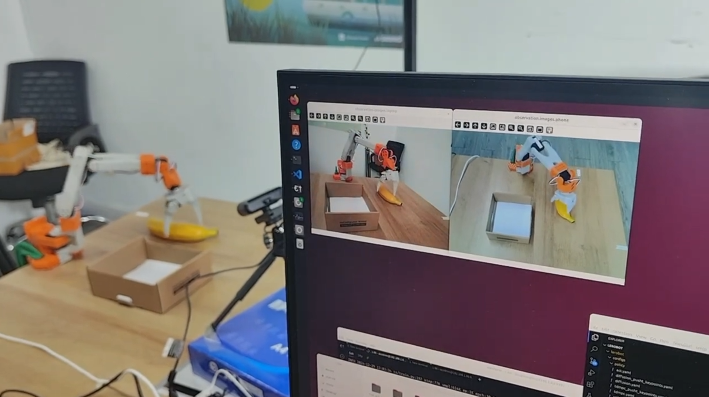
  </a>
</p>
<p align="center">
  <em>▶ Click to watch the SO-ARM101 leader–follower demo on YouTube</em>
</p>

<br>

---

<br>

## Specifications (key differences)

| Item | SO-ARM100 Kit | SO-ARM100 Kit Pro | SO-ARM101 Kit | SO-ARM101 Kit Pro |
|------|---------------|-------------------|---------------|-------------------|
| **Leader arm motors** | 12× ST-3215-C001 (7.4 V), ~1:345 all joints | 12× ST-3215-C018 / C047 (12 V), ~1:345 all joints | 1× C001 (7.4 V, ~1:345) J2 · 2× C044 (7.4 V, ~1:191) J1 & J3 · 3× C046 (7.4 V, ~1:147) J4–J6 | Same leader layout (12 V rails) * |
| **Follower arm** | Same as leader | Same as leader | Same as SO-ARM100 follower | Same as SO-ARM101 follower |
| **Power supply** | 5.5 × 2.1 mm barrel, 5 V 4 A | 5.5 × 2.1 mm barrel, 12 V 2 A | 5.5 × 2.1 mm barrel, 5 V 4 A | 12 V 2 A (follower) + 5 V 4 A (leader) |
| **Angle sensor** | 12-bit magnetic encoder | Same | Same | Same |
| **Operating range** | 0 °C – 40 °C | Same | Same | Same |
| **Communication** | UART | Same | Same | Same |

> \* *Exact motor list for SO-ARM101 Kit Pro to be confirmed.*

<br>

---

<br>

<h1 align="center">Complete Setup</h1>

<p align="center"><em>Each card below links to a dedicated guide. Follow them in order for a smooth build experience.</em></p>

<br>

<h3 align="center">Phase 1 — Planning & Fabrication</h3>

<p align="center">
  <a href="docs/bom.md">
    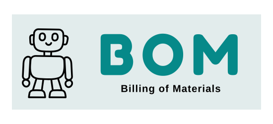
  </a>
  <a href="docs/ise.md">
    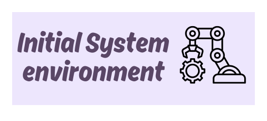
  </a>
  <a href="docs/3d.md">
    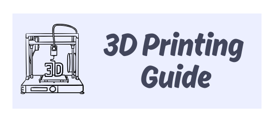
  </a>
</p>

<br>

<h3 align="center">Phase 2 — Build & Configure</h3>

<p align="center">
  <a href="docs/install.md">
    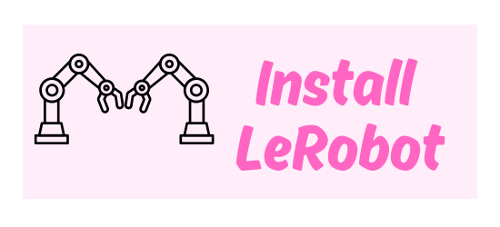
  </a>
  <a href="docs/configure_motors.md">
    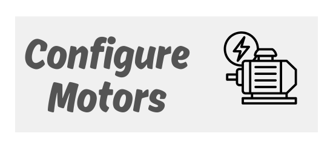
  </a>
  <a href="docs/assembly.md">
    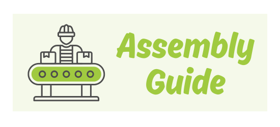
  </a>
</p>

<br>

<h3 align="center">Phase 3 — Calibrate & Operate</h3>

<p align="center">
  <a href="docs/calibrate.md">
    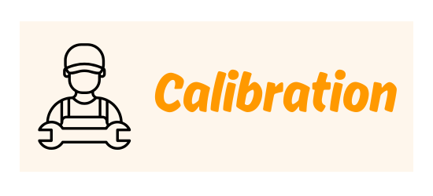
  </a>
  <a href="docs/teleoperate.md">
    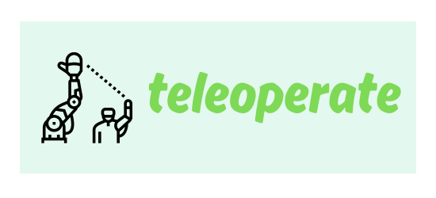
  </a>
  <a href="docs/cameras.md">
    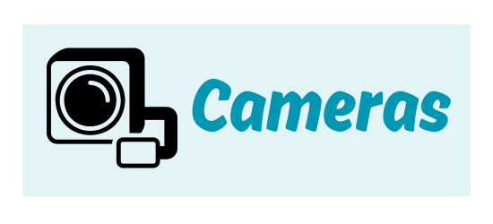
  </a>
</p>

<br>

---

<br>

<h1 align="center">🥝 KIWI Control Center</h1>

<p align="center">
  <em>Keep It Witty & Interactive — a unified web dashboard for real-time arm control, gesture execution, and interactive dataset recording.</em>
</p>

<br>

<p align="center">
  <a href="kiwi_control_center.py">
    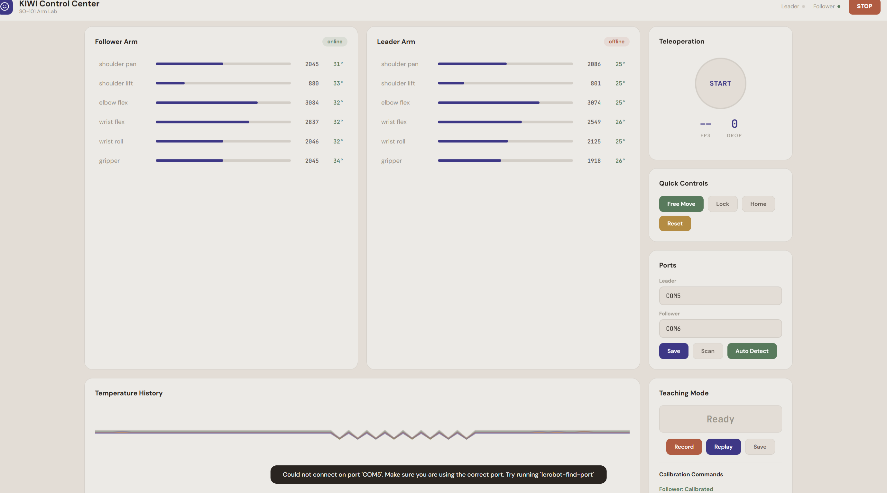
  </a>
</p>

<br>

The **KIWI Control Center** is a Flask + SocketIO web application that provides a browser-based interface for controlling both SO-101 arms and recording imitation-learning datasets — all from a single URL. It runs on both Windows and Jetson, with two tabs:

<br>

### 🎛️ Dashboard Tab

Real-time arm control and monitoring.

| | Feature | Description |
|---|---------|-------------|
| 📷 | **Live camera feeds** | Auto-detects all connected USB cameras with smooth MJPEG streaming and snapshot capture |
| 🤖 | **Dual-arm status** | Real-time position, temperature readouts for all 12 servos across both arms |
| 👋 | **Gesture library** | One-click gestures (wave, nod, shake, thumbs up, point, dance) with color-coded tiles — each returns to resting position automatically |
| 🕹️ | **Teleoperation** | Start/stop LeRobot-based teleop from the browser with live FPS and drop count |
| 🔒 | **Port-safe architecture** | Thread-safe serial communication with `threading.Lock()` — no conflicts between polling and commands |
| 🔴 | **Emergency stop** | Instant torque kill across all servos |
| 🔍 | **Auto port detection** | Finds connected arms automatically on both Windows (`COM*`) and Linux (`/dev/ttyACM*`) |

<br>

### 🎬 Recorder Tab

Interactive dataset collection with preview and HuggingFace integration.

| | Feature | Description |
|---|---------|-------------|
| ▶️ | **Start/Stop recording** | Click or press Enter to start/stop an episode — no fixed timer |
| 👁️ | **Preview playback** | After stopping, camera feeds switch to PREVIEW mode replaying your recorded episode so you can review before saving |
| ✅ | **Save / Discard** | Press `y` to save, `n` to discard — bad episodes never pollute your dataset |
| 📤 | **Auto-push to HuggingFace** | Toggle on to automatically push each saved episode to your HF repo in the background |
| 🔢 | **Target +/- controls** | Adjust episode target (−10, −1, +1, +10) — progress bar fills as you go |
| 🔀 | **Camera swap** | Swap Gripper/Overhead labels if cameras are detected in wrong order |
| ⌨️ | **Keyboard shortcuts** | Enter = start/stop, y = save, n = discard |

**Each saved episode contains:**
- Camera frames (JPEG) from all detected cameras at 30fps
- Servo positions for all 6 joints at 30fps
- Timestamped `servo_data.json` with task metadata

<br>

### Quick Start

```bash
# On Jetson
cd ~/so101-robotic-arm-lab
pip install flask flask-socketio pyserial

python kiwi_control_center.py
```

Open **http://localhost:5000** in your browser. Click the **Recorder** tab to collect datasets.

**Published dataset:** [`G3nadh/so101_pick_place`](https://huggingface.co/datasets/G3nadh/so101_pick_place) — 50 episodes of pick-and-place with dual cameras.

<br>

---

<br>

<h1 align="center">Imitation Learning</h1>

<p align="center">
  <em>Teach the robot by showing, not programming — collect human demonstrations, train a visuomotor policy, and deploy it back on the real arm.</em>
</p>

<br>

Imitation learning (IL) is the core approach we use to make the SO-101 perform useful tasks autonomously. Instead of hand-coding every motion, we **record expert demonstrations** using the leader–follower teleoperation setup, then **train a neural policy** that maps camera observations and joint states to motor actions. The trained policy is deployed directly on the arm (or on the Jetson for on-board inference), producing fluid, reactive behavior that generalizes across small variations in object position and orientation.

LeRobot supports several state-of-the-art IL architectures out of the box. The two we focus on in this lab are:

| Architecture | What It Does | Strengths |
|---|---|---|
| **ACT** (Action Chunking with Transformers) | Predicts *chunks* of future actions using a Transformer, reducing compounding error. | Fast inference, smooth trajectories, works well with 50–100 demonstrations. |
| **Diffusion Policy** | Formulates action prediction as a denoising diffusion process over the action space. | Handles multi-modal action distributions; robust to ambiguous demonstrations. |

<br>

The imitation learning workflow has three stages, each covered in detail below.

<br>

<h2 align="center">Stage 1 · Data Collection</h2>

<p align="center">
  <a href="docs/data_collection.md">
    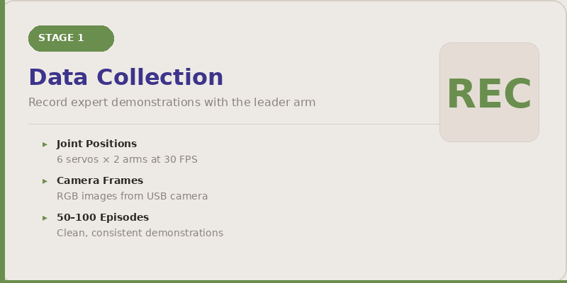
  </a>
</p>

<br>

High-quality demonstrations are the foundation of every successful policy. We provide **two methods** for data collection:

**Method 1 — KIWI Recorder (recommended for interactive control):**

Use the Recorder tab in the KIWI Control Center for a fully interactive workflow with live camera preview, episode-by-episode save/discard, and auto-push to HuggingFace.

```bash
python kiwi_control_center.py
# Open http://localhost:5000 → click Recorder tab
```

**Method 2 — LeRobot CLI (recommended for LeRobot-native format):**

Use LeRobot's built-in recording command for datasets that are directly compatible with ACT/Diffusion Policy training.

```bash
lerobot-record \
  --robot.type=so101_follower \
  --robot.port=/dev/ttyACM1 \
  --robot.id=follower_arm \
  --teleop.type=so101_leader \
  --teleop.port=/dev/ttyACM0 \
  --teleop.id=leader_arm \
  --robot.cameras='{"gripper": {"type": "opencv", "index_or_path": 0, "width": 640, "height": 480, "fps": 30}, "overhead": {"type": "opencv", "index_or_path": 4, "width": 640, "height": 480, "fps": 30}}' \
  --dataset.repo_id=G3nadh/so101_pick_place \
  --dataset.single_task="Pick object and place in box" \
  --dataset.num_episodes=50 \
  --dataset.episode_time_s=20 \
  --dataset.reset_time_s=5 \
  --dataset.push_to_hub=true \
  --display_data=true
```

**Best practices for collecting demonstrations:**

- **Consistency matters.** Keep object placement, lighting, and camera angles as stable as possible across episodes. Small, deliberate variations help generalization — random chaos does not.
- **Aim for 50–100 episodes** per task as a starting point. Simple pick-and-place tasks can work with fewer; complex multi-step tasks may need more.
- **Slow, deliberate motions** produce cleaner data than fast, jerky ones. The policy learns from what it sees — noisy demonstrations yield noisy behavior.
- **Review your data** after collection. Use the KIWI Recorder's preview playback to review each episode before saving.

> 📖 **Full walkthrough →** [docs/data_collection.md](docs/data_collection.md)

<br>

---

<br>

<h2 align="center">Stage 2 · Training</h2>

<p align="center">
  <a href="docs/training.md">
    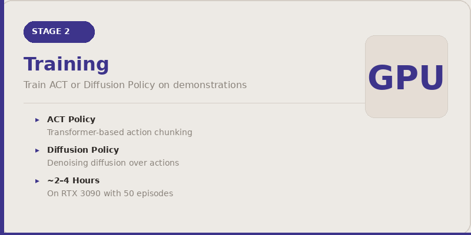
  </a>
</p>

<br>

Once demonstrations are collected, the next step is to train a policy that can reproduce (and generalize from) the recorded behavior. LeRobot handles the heavy lifting — dataset loading, augmentation, model architecture, and logging — so you can focus on experiment design.

**Training overview:**

1. **Choose an architecture.** ACT is a great default — fast to train, easy to tune. Switch to Diffusion Policy if your task has multiple valid strategies.
2. **Configure your run.** LeRobot uses Hydra-based YAML configs for full control over hyperparameters.
3. **Launch training.** A single command kicks off the full pipeline.
4. **Monitor convergence.** Watch the training and validation loss curves.

```bash
python lerobot/scripts/train.py \
  --policy.type=act \
  --dataset.repo_id=G3nadh/so101_pick_place \
  --dataset.episodes=[0:50] \
  --training.num_epochs=2000 \
  --training.batch_size=8 \
  --output_dir=outputs/act_pick_place \
  --wandb.enable=true
```

| Platform | Training Experience |
|---|---|
| **Cloud / desktop GPU** (RTX 3090, A100, etc.) | Recommended for full training runs. ACT trains in ~2–4 hours on 50 episodes. |
| **Jetson Orin Nano Super** | Viable for small-scale fine-tuning and experimentation. Full training is slower but doable for sub-200M-param models. |

> 📖 **Full walkthrough →** [docs/training.md](docs/training.md)

<br>

---

<br>

<h2 align="center">Stage 3 · Evaluation & Deployment</h2>

<p align="center">
  <a href="docs/deployment.md">
    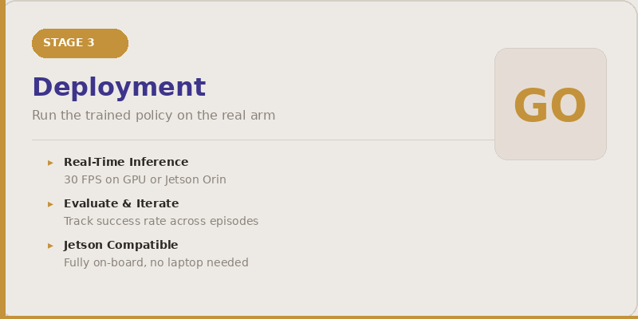
  </a>
</p>

<br>

The final stage closes the loop: load the trained policy, run inference in real time, and watch the arm execute the task autonomously.

```bash
python lerobot/scripts/control_robot.py \
  --robot.type=so101 \
  --control.type=record \
  --control.fps=30 \
  --control.single_task="Pick up the block and place it in the bin" \
  --control.policy.path=outputs/act_pick_place/checkpoints/last/pretrained_model \
  --control.num_episodes=10
```

| Symptom | Likely Cause | Fix |
|---------|-------------|-----|
| Arm reaches toward the object but misses | Camera angle shifted | Re-mount camera or collect more demos |
| Gripper closes too early / too late | Inconsistent gripper timing in demos | Re-record with deliberate gripper actions |
| Jerky, stuttering motion | Low control frequency | Increase FPS or reduce image resolution |
| Arm freezes or random actions | Wrong checkpoint | Verify config matches training setup |

> 📖 **Full walkthrough →** [docs/deployment.md](docs/deployment.md)

<br>

---

<br>

<h2 align="center">The Full Loop</h2>

<p align="center">
  <em>The imitation learning cycle is inherently iterative — each deployment reveals what the policy still needs to learn.</em>
</p>

<br>

```
  ┌──────────────────────────────────────────────────────────────────┐
  │                                                                  │
  │    ┌─────────────┐    ┌─────────────┐    ┌──────────────────┐   │
  │    │    COLLECT   │    │    TRAIN    │    │     DEPLOY       │   │
  │    │  demos with  │───▶│  ACT or     │───▶│  run policy on   │   │
  │    │  leader arm  │    │  Diffusion  │    │  the real arm    │   │
  │    └─────────────┘    └─────────────┘    └────────┬─────────┘   │
  │           ▲                                       │             │
  │           │           Evaluate & iterate          │             │
  │           └───────────────────────────────────────┘             │
  │                                                                  │
  └──────────────────────────────────────────────────────────────────┘
```

<br>

---

<br>

## Roadmap

We are actively extending this platform. Here's what's on the horizon:

- [x] **KIWI Control Center** — Web-based dashboard for real-time arm control, gesture execution, and system monitoring ✅
- [x] **Interactive Dataset Recorder** — Browser-based recording with preview, save/discard, auto-push to HuggingFace ✅
- [x] **Dual camera integration** — Auto-detect Arducam (gripper) + RealSense (overhead) with live MJPEG streaming ✅
- [x] **First dataset published** — [`G3nadh/so101_pick_place`](https://huggingface.co/datasets/G3nadh/so101_pick_place) — 50 pick-and-place episodes ✅
- [x] **Jetson Orin Nano deployment** — Full pipeline running on-device: cameras, teleop, dashboard, recording ✅
- [ ] **ACT policy training** — Train first pick-and-place policy on collected dataset
- [ ] **Diffusion Policy comparison** — Train and benchmark against ACT
- [ ] **LeKiWi mobile base integration** — Mount the SO-101 on a mobile base for autonomous navigation + manipulation
- [ ] **Multi-arm coordination** — Synchronized dual-arm tasks (e.g., bi-manual pick-and-place, choreographed demos)
- [ ] **Face & emotion recognition** — Vision pipeline for personalized human–robot interaction
- [ ] **Pre-trained policy zoo** — Ready-to-deploy checkpoints for common tasks (pick-place, stacking, sorting)

<br>

---

<br>

## Contributing

We welcome contributions from students, researchers, and hobbyists. Whether it's fixing a typo, adding a new task demo, or improving the training pipeline — every contribution helps.

1. **Fork** the repository
2. **Create a branch** for your feature (`git checkout -b feature/your-feature`)
3. **Commit** your changes with clear messages
4. **Open a Pull Request** describing what you changed and why

For questions, ideas, or bug reports, please [open an issue](https://github.com/Qian-Group-HRI/so101-robotic-arm-lab/issues).

<br>

---

<br>

## Acknowledgments

This project builds on the work of many open-source communities and research groups:

- **[TheRobotStudio](https://www.therobotstudio.com/)** — for the SO-10xARM hardware design and open-source philosophy
- **[HuggingFace LeRobot](https://github.com/huggingface/lerobot)** — for the imitation learning framework that powers our training and deployment pipeline
- **[NVIDIA Jetson](https://developer.nvidia.com/embedded-computing)** — for making powerful edge AI accessible to robotics researchers
- **[Vizuara AI](https://www.vizuara.ai/)** — *Modern Robotics Learning From Scratch* course by Dr. Rajat, which informed much of our learning journey
- **Qian Group, University of Houston** — for lab resources, mentorship, and the space to build

<br>

<p align="center">
  &nbsp;
  &nbsp;
  &nbsp;
  &nbsp;
  
</p>

<p align="center">
  <sub>© 2025 Qian Group · Human–Robot Interaction Lab · University of Houston</sub>
</p>
